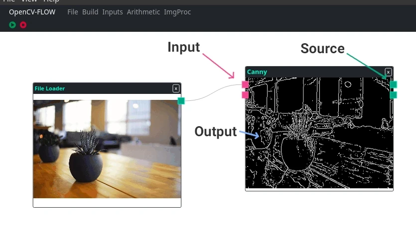

IO Endless Component is similar to IO Component, with the only difference, the amount of inputs is unlimited. 
As new inputs are connected, new inputs and outputs are created.



Below is the component created to process the Canny edge detector from the opencv library represented in the image above.

```typescript
export class CannyComponent extends CVFIOEndlessComponent {
  static processor = class SobelProcessor extends CVFNodeProcessor {
    async proccess() {
      this.sources = [];
      for (const src of this.inputs) {
        const dst = new cv.Mat(src.rows, src.cols, cv.CV_8UC1);

        cv.cvtColor(src, src, cv.COLOR_RGB2GRAY, 0);
        cv.Canny(src,dst, 80, 170);

        this.sources.push(dst);
        this.output(dst);
      }
    }
  };
}
```