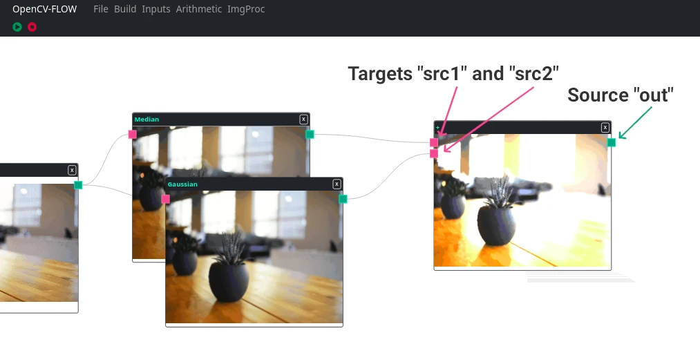

OpenCV-Flow allows you to create components with custom input and sources.



Below is the component created to process the Add operator from the opencv library represented in the image above.

```typescript
export class PlusComponent extends CVFComponent {
  //Node inputs definitions
  targets: TargetHandle[] = [
    { title: "src1", position: Position.Left },
    { title: "src2", position: Position.Left },
  ];
  //Node outputs definitions
  sources: SourceHandle[] = [
    { title: "out", position: Position.Right }
  ];

  static processor = class PlusProcessor extends CVFNodeProcessor {
    async proccess() {
        const [src1, src2] = inputs; //Inputs from targets definitions
        const out: Mat = new cv.Mat(src1.rows, src1.cols, src1.type(), new cv.Scalar(0));

        cv.add(src1, src2, out);

        this.sources = [out];//same number of outputs as sources definitions
        this.output(out);
    }
  };
}
```


### Handle Directions

informing the "position" property as an attribute of the targets or sources, 
it is possible to indicate the position of the inputs and outputs in the components

Possible positions:
```typescript
enum Position {
    Left = "left",
    Top = "top",
    Right = "right",
    Bottom = "bottom"
}
```