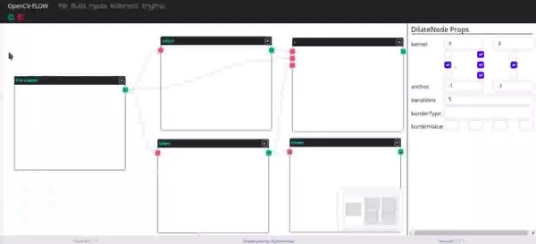

OpenCV-Flow is a IDE for test and teach computer vision techniques from typescript language. 
These can be simple static diagrams or complex editors. 
You can implement custom node types and edge types and it comes with components like a mini-map and graph controls.

The IDE was built from OpenCV.js, React, React-Flow and MobX libraries. Its style was customized from bootstrap. 
The operating engine is built on the Electron framework.

