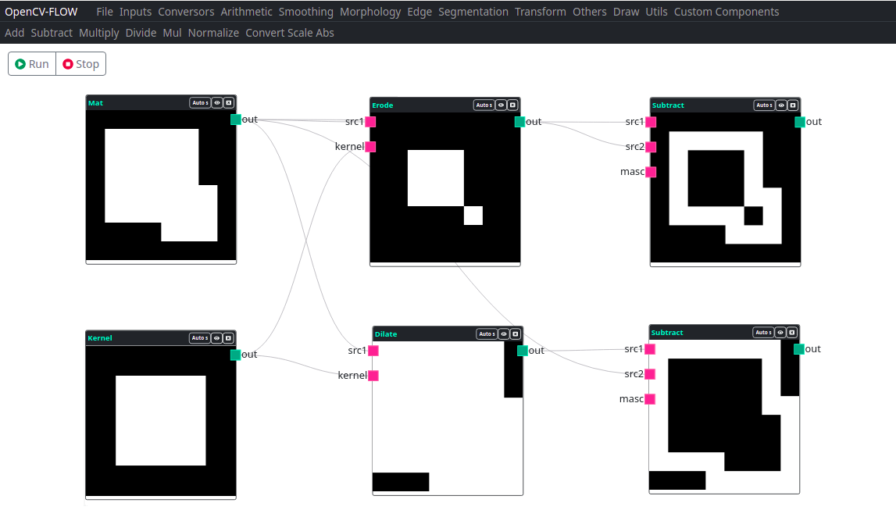
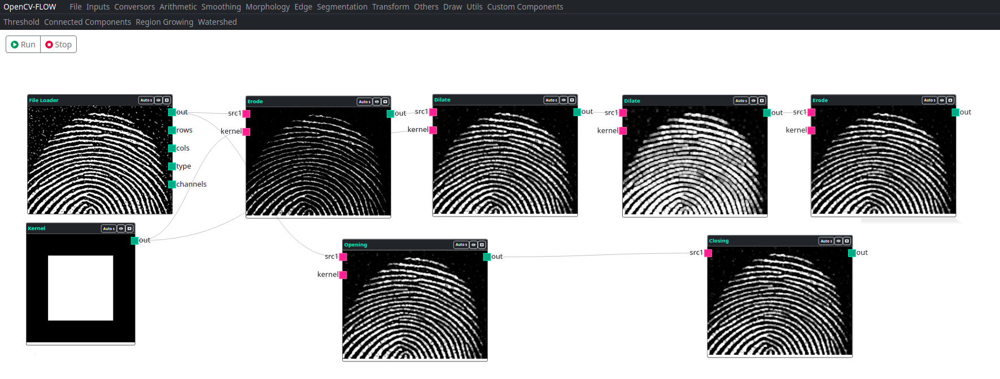

Mathematical Morphology is a tool for extracting image components, useful for representing and describing the shape of a region,
such as borders, skeletons, highlighting, filtering, segmentation, skeletonization and others.

## Erode & Dilate

Erosion and dilation are the basis of all morphological image processing operations.

By means of a structuring element, erosion performs a search in the image of such a structure,
and creates an output image where each pixel in this image indicates that the structure has been located.

Dilation, in turn, for each pixel of the input image that has information,
replicates the structure in the output image.

The types of outputs of these components are:

| Output    | Description |
|-----------|-------------|
| Out       | Imagee / **Opencv Mat**   |

## Opening & Closing 

Opening and closing are operations that only enqueue the erosion and dilation operations.

The opening performs the operation erosion followed by dilation.
This sequence of operations results in the opening of structures in the image.

The closure performs the dilation operation followed by erosion.
This sequence of operations results in the closure of structures in the image.

The types of outputs of these components are:

| Saída     | Descrição |
|-----------|-----------|
| Out       | Imagem / **Opencv Mat**   |
