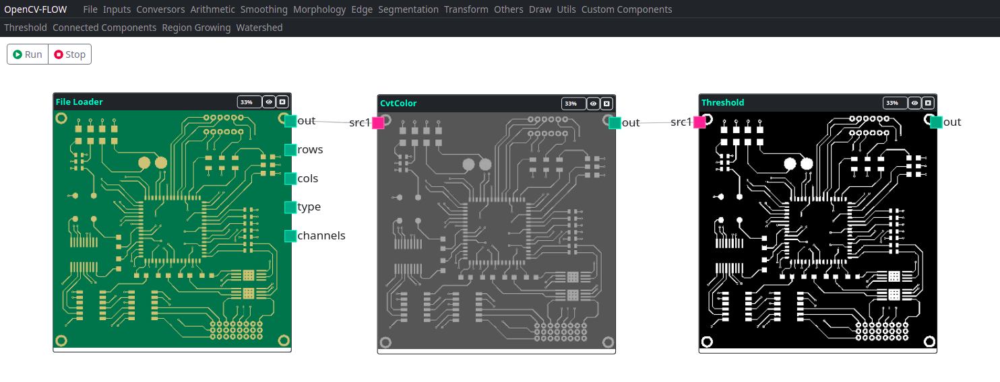

A segmentação de imagem é uma tarefa de processamento de imagem na qual a imagem é segmentada ou particionada em várias regiões, de modo que os pixels na mesma região compartilhem características comuns.

## Threshold

Uma das técnicas de segmentação mais comumente usadas é a limiarização. É amplamente utilizado em visão computacional e é muito útil para separar o objeto que nos interessa do fundo.

Thresholding é o processo de binarização de uma imagem. Este é o tipo mais básico de limiarização, ele consiste em separar a matriz/imagem em tons de cinza em uma imagem em binária (pretro e branco).

