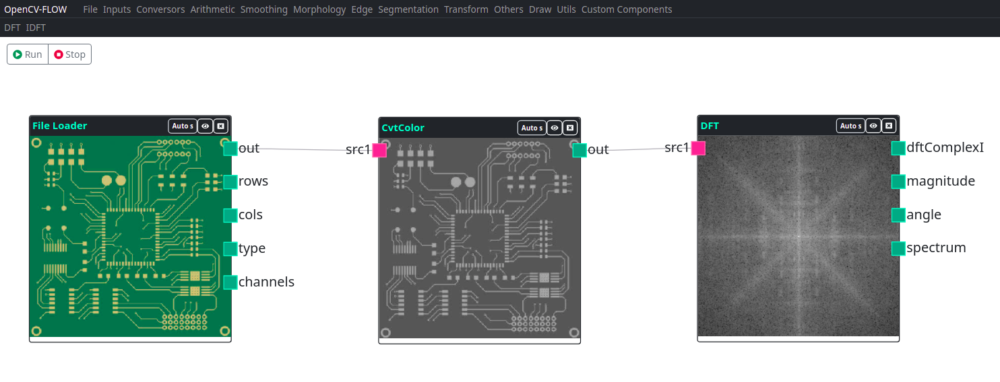

Transformation nodes perform transformed mathematics. Each transform has its logic and particular function.

## DFT

OpenCV function: **cv.dft, cv.getOptimalDFTSize, **

The DFT component performs the discrete Fourier transform.

## IDFT

OpenCV function: **cv.dft with cv.DCT_INVERSE**

The IDFT component performs the inverse of the discrete Fourier transform.