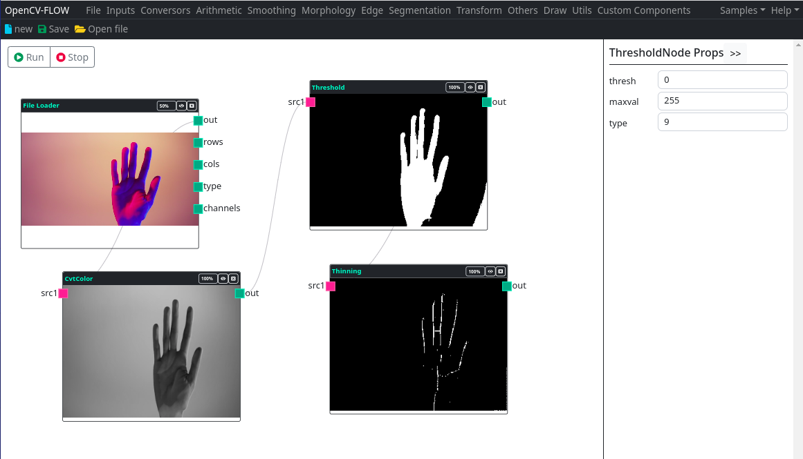
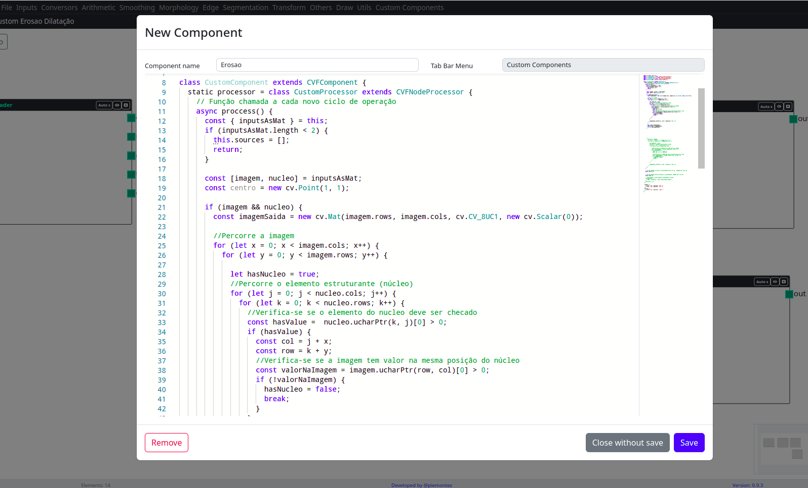

OpenCV-Flow is an IDE for visualizing, testing and teaching computer vision techniques from the typescript/javascript language.

Through the creation of processing flows it is possible to chain image processing and computer vision operations.

You can also create custom, programmable components and add them to the IDE's processing streams.

> The opencv.js library is the processing base of this IDE.
> Generally speaking, components and nodes are just visual instruments that perform functions in this library.

> Basic knowledge of the opencv.js library is highly recommended.

The IDE was built from OpenCV.js, React, React-Flow libraries. Its style was customized from bootstrap. The operating mechanism is built into the structure of the electron.