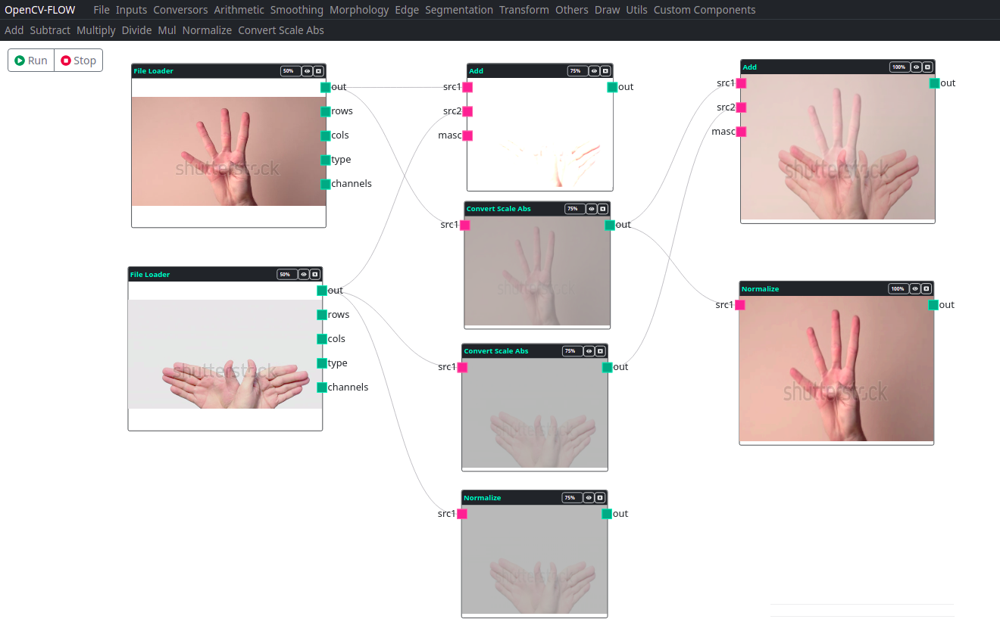

Nós de operações aritiméticas, realizam operações matemáticas básicas como adição, subtração, multiplicação, divisão.

> A saída principal dos nós de entrada é uma matriz do tipo Mat do opencv.js.

A seguir um exemplo de operações básicas de operações matemáticas. 
Observe os componentes de adição, note que o primeiro ficou saturado pois a soma de cada pixel ultrapassou o máximo de cor permitido,
ficando assim com a cor branca.

## Add

Função OpenCV: **cv.add**

O componente calcula a soma de cada pixel entre duas matrizes.

## Subtract

Função OpenCV: **cv.subtract**

O componente calcula a subtração de cada pixel entre duas matrizes.

## Multiply

Função OpenCV: **cv.multiply**

O componente calcula a multiplicação entre duas matrizes.

## Divide

Função OpenCV: **cv.divide**

O componente calcula a divisão de cada pixel entre duas matrizes.

## Mul

Função OpenCV: **cv.mul**

O componente calcula a multiplicação elemento a elemento entre duas matrizes.