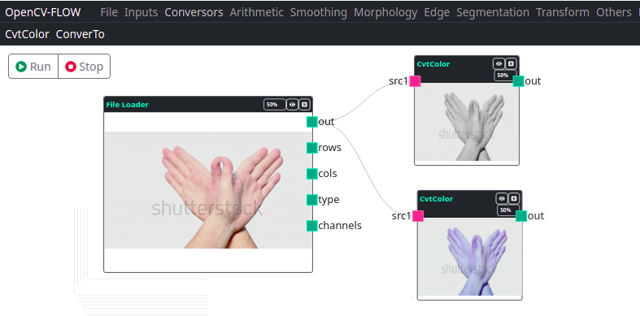

Nós conversores, são componentes que realizam conversaão de tipo de dados afim de possibilitar operações entre os componentes.

Estão componentes são necessários como etapa de pré-processamento de muitos componentes que utilizam a biblioteca opencv.js.
Muitos componentes utilizam uma quantidade específica de canais de imagens, 
determinados componentes procassam apenas tipos de dados inteiros e outros apenas decimais,
a também componentes que processam dados em variações de ponto flutuantes entre 0 e 1.

>
> É recomendado que os usuários da IDE tenham nossões básicas do funcionamento da biblioteca OpenCV, 
> ou ao menos saibam como funcionam a estrutura da Matriz Mat desta biblioteca.
> Leia mais em: 
> [Mat - The Basic Image Container](https://docs.opencv.org/4.x/d6/d6d/tutorial_mat_the_basic_image_container.html)
> e
> [Basic Operations on Images](https://docs.opencv.org/4.x/de/d06/tutorial_js_basic_ops.html)

## Cvt Color

Componente responsável por converter o tipo de dado Mat

