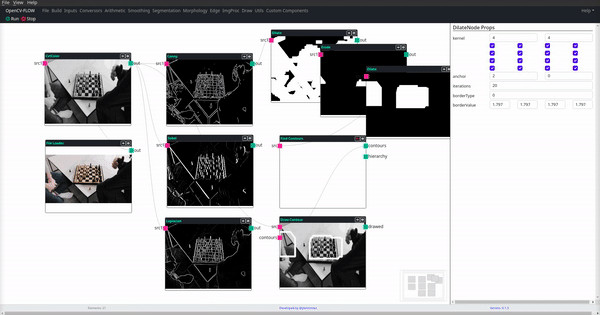

A detecção de borda é uma técnica de processamento de imagem usada para identificar os limites (bordas) de objetos ou regiões dentro de uma imagem. As bordas estão entre os recursos mais importantes associados às imagens.

A seguir um exemplo de operações de detecção de bordas Canny, Sobel e Laplacian.

## Sobel

Função OpenCV: **cv.Sobel**

Este componente processa a função Sobel do Opencv.js

## Canny

Função OpenCV: **cv.Canny**

Este componente processa a função Canny do Opencv.js

## Laplacian

Função OpenCV: **cv.Laplacian**

Este componente processa a função Laplacian do Opencv.js

## Scharr

Função OpenCV: **cv.Scharr**

Este componente processa a função Scharr do Opencv.js

## Find Contours

Função OpenCV: **cv.findContours**

Este componente processa a função findContours do Opencv.js
