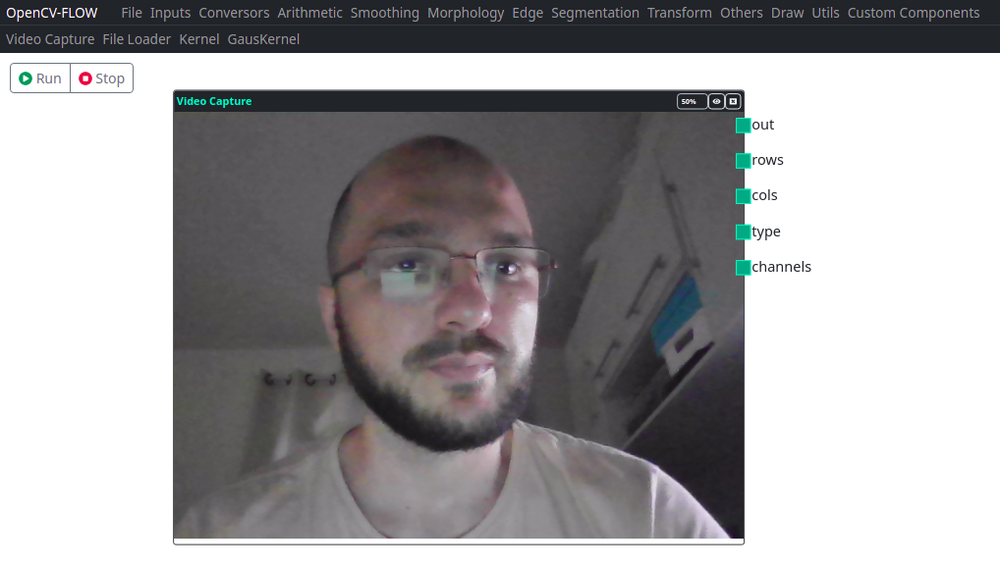
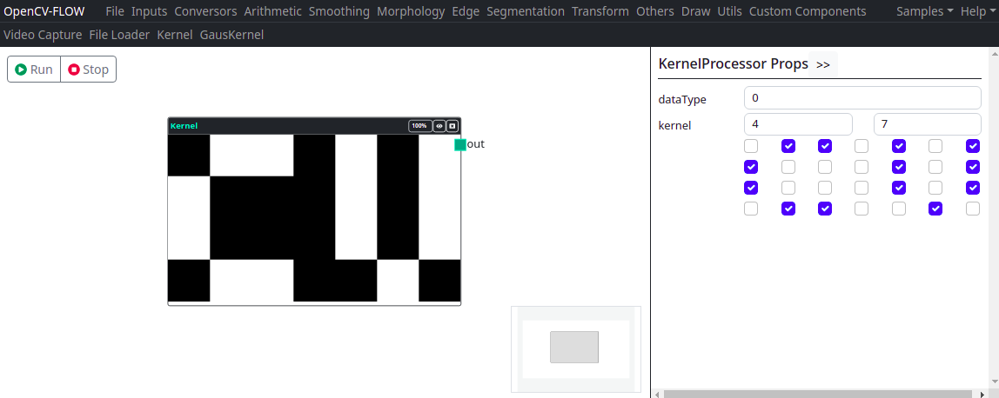
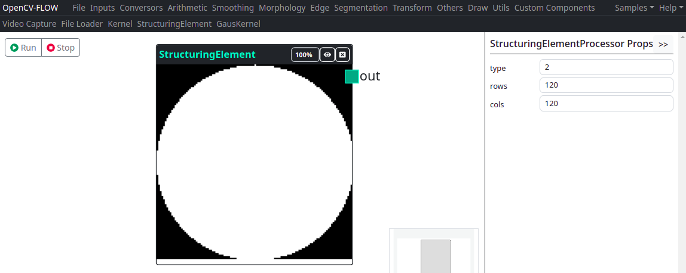

Nós de entradas são componentes que carregam vídeos e imagens ou geram núcleos de dados para serem processados por outros componentes.

> A saída principal dos nós de entrada é uma matriz do tipo Mat do opencv.js.
> As saídas podem ter diferentes quantidades de canais de cores.

## Video Capture

Função OpenCV: **cv.VideoCapture**

Componente responsável por capturar o stream de vídeo da câmera conectada ao computador.

As saídas deste componente são:

| Saída     | Descrição |
|-----------|-----------|
| Out       | Imagem / **Opencv Mat**   |
| Rows      | Quantidade de linhas      |
| Cols      | Quantidade de colunas     |
| Type      | Tipo de Imagem / **Opencv Mat Type**  |
| Channels  | Quantidade de canais da imagem        |

## File Loader

O componente "File Loader" carrega imagens e videos do computador. 
Os tipos de imagens que a IDE consegue carregar são limitadas aos tipos de imagens que a biblioteca Opencv.js carrega.

Os tipos de saídas deste componente são:

| Saída     | Descrição |
|-----------|-----------|
| Out       | Imagem / **Opencv Mat**   |
| Rows      | Quantidade de linhas      |
| Cols      | Quantidade de colunas     |
| Type      | Tipo de Imagem / **Opencv Mat Type**  |
| Channels  | Quantidade de canais da imagem        |

## Kernel

O Componente "Kernel" cria um matriz Mat de saída, conforme o arranjo informado.
Os valores da matriz são 0 ou 1. 

Os tipos de saídas deste componente são:

| Saída     | Descrição |
|-----------|-----------|
| Out       | Imagem / **Opencv Mat**   |

## Mat

O Componente "Mat" cria uma Matriz Mat de saída, conforme o arranjo informado.
Os valores da matriz podem ser informadas via propriedades do componente.

Os tipos de saídas deste componente são:

| Saída     | Descrição |
|-----------|-----------|
| Out       | Imagem / **Opencv Mat**   |

## Structured Element

Função OpenCV: **cv.getStructuringElement**

O Componente "Structured Element" cria uma imagem estruturada.
É possível criar uma estrutura do tipo retângulo, círculo ou cruz.

Os tipos de saídas deste componente são:

| Saída     | Descrição |
|-----------|-----------|
| Out       | Imagem / **Opencv Mat**   |
