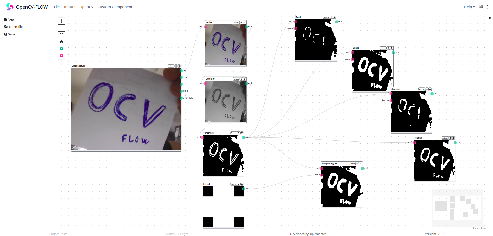

<style scoped>
.top {'{'}
    padding: 80px 40px; 
    margin: 0 0 70px  0; 
    background-color: #eeeeee
}
.topcontent {'{'}
    width: 100%; 
    max-width: 1400px; 
    margin: 0 auto; 
    display: flex;
}
.topleft, .topright {'{'}
    flex: 1
}
.topimg {'{'}
    -webkit-transform: scale(0.9) perspective(800px)
    rotateY(+41deg) rotateX(5deg) rotate(2deg);
    transform: scale(1) perspective(800px) rotateY(+41deg) rotateX(5deg) rotate(2deg);
}
.topimg img {'{'}
    border: 1px solid #9C9C9C;
    border-radius: 10px;
}
@media only screen and (max-width: 780px) {'{'}
  .topcontent {'{'}
    flex-direction: column;
  }
  .topleft {'{'}
    margin-left: 13%;
    width: 80%;
    text-align: center;
    margin-bottom: 40px;
  }
}
</style>

<div class="top">
    <div class="topcontent">
        <div class="topleft">
            <div class="topimg">
                
            </div>
        </div>
        <div class="topright">
            <div class="work-text-full">
            <div class="work-text">
                <h1>Computer Vision IDE</h1>
                <p>
                    OpenCV-Flow é projetado para estudantes, professores e desenvolvedores de javascript.
                </p>
                <h2>Como funciona?</h2>
                <p>
                    Através de fluxogramas você pode encadear 
                    diferentes operações de visões computacionais
                    e execute seu fluxo para visualizar o efeito
                    produzido em um determinado vídeo ou imagem.
                </p>
                <br />
                <a href="https://online.opencvflow.org/" style="display: block; width: 49%; background-color: #fff; padding:10px 15px; border-radius:8px; border:1px solid rgb(244, 143, 177); color: rgb(236, 106, 150);  margin-right: 10px; margin-bottom: 10px;">
                    Versão Online
                </a>
                <a href="/pt/overview" style="display: block; width: 49%; background-color: #fff; padding:10px 15px; border-radius:8px; border:1px solid rgb(0, 156, 130); color: rgb(0, 156, 130);">
                    Documentação
                </a>
            </div>
            </div>
        </div>
    </div>
</div>


<style scoped>
.steps {'{'}
    width: 100%; max-width: 1400px; margin: 0 auto; padding: 0 24px;
}
.stepheader {'{'}
    width: 40%; 
    margin-bottom: 30px;
}
@media only screen and (max-width: 780px) {'{'}
    .stepheader {'{'}
        width: 100%; 
    }
}
</style>

<div class="steps">
<div class="stepheader">

## Três passos simples

Open Computer Vision - Flow é um IDE para estudos e testes de visão computacional. 
Em apenas 3 passos você pode visualizar o resultado de diferentes técnicas de visão computacional.

</div>

<div style="display: flex; flex-direction: row; margin-bottom: 80px; text-align: center">
    <div style="flex: 1">
        <div style="width: 40%; margin: 0 auto; ">
            
        </div>
        <h2>Pesquisa</h2>
        <p>Identificar as técnicas que serão utilizadas no projeto.</p>
    </div>
    <div style="flex: 1">
        <div style="width: 40%; margin: 0 auto; ">
            
        </div>
        <h2>Fluxograma</h2>
        <p>Desenhe o fluxograma do seu projeto com componentes OpenCV-Flow</p>
    </div>
    <div style="flex: 1">
        <div style="width: 40%; margin: 0 auto; ">
            
        </div>
        <h2>Visualizar</h2>
        <p>Visualize o resultado das técnicas aplicadas em tempo real</p>
    </div>
</div>


<style scoped>
.components {'{'}
    display: flex;
    flex-direction: row;
}
.compleft, .compright {'{'}
    flex: 1
}
@media only screen and (max-width: 780px) {'{'}
    .components {'{'}
        flex-direction: column;
    }
    .compleft {'{'}
        margin-bottom: 20px;
    }
}
</style>


<div class="components">
    <div class="compleft">
        <h2>Componentes personalizados</h2>
        <p style="padding-right: 100px">
            O OpenCV-Flow permite adicionar componentes personalizáveis a IDE. 
            Os nós são processados usando a função "process". 
            Os dados de entrada do nó podem ser acessados por meio de this.inputs. 
            As saídas são informadas na propriedade this.sources. 
            E para exibir em tela basta chamar a função de saída.
        </p>
    </div>
    
<div class="compright">

```typescript
import cv, { Mat } from 'opencv-ts';

export class SobelComponent extends CVFIOComponent {
  static processor = class SobelProcessor extends CVFNodeProcessor {
    async proccess() {
      this.sources = [];
      for (const src of this.inputs) {
        const dst = new cv.Mat(src.rows, src.cols, cv.CV_8UC1);

        cv.cvtColor(src, src, cv.COLOR_RGB2GRAY, 0);
        cv.Sobel(src,dst, cv.CV_8U, 1, 0, 3, 1, 0, cv.BORDER_DEFAULT);

        this.sources.push(dst);
        this.output(dst);
      }
    }
  };
}
```

</div>
</div>

</div>
