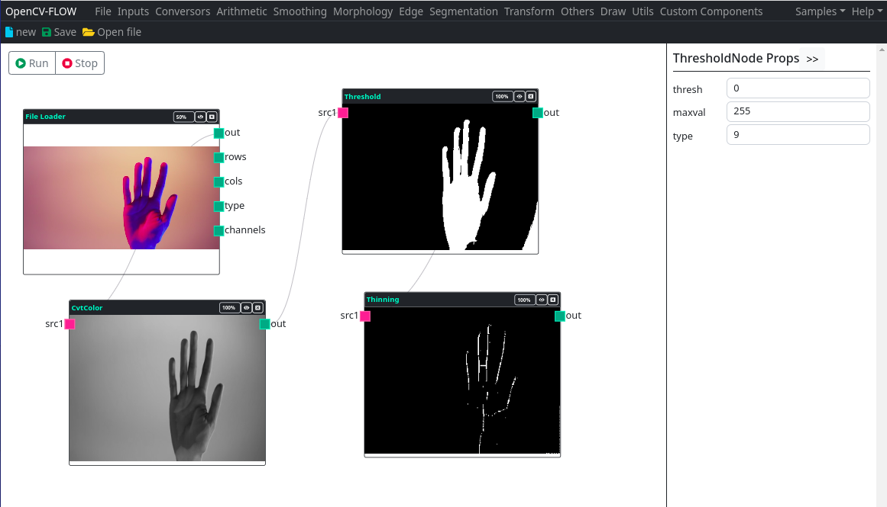
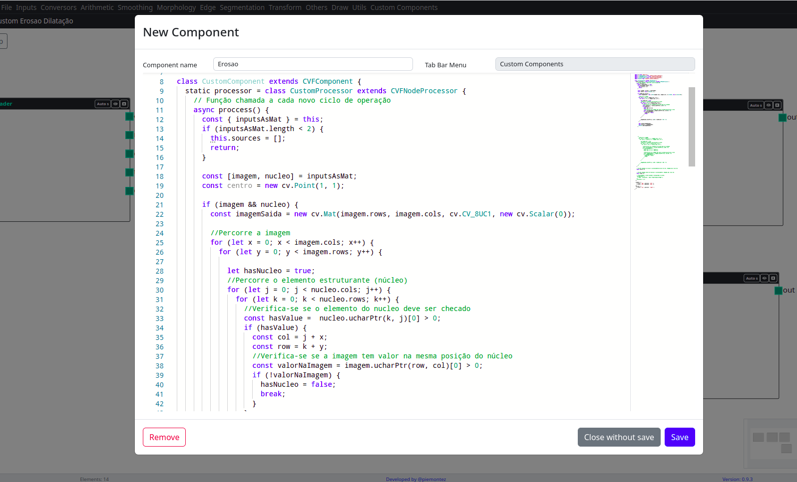

OpenCV-Flow é um IDE para visualizar, testar e ensinar técnicas de visão computacional a partir da linguagem typescript/javascript. 

Através da criação de fluxos de processamento é possível encadear operações de processamento de imagens e visão computacional.

Também é possível criar componentes programáveis e adicioná-los nos fluxos de processamento da IDE.

> A biblioteca opencv.js é a base dos processamentos desta IDE.
> De modo geral, os componentes e nós são apenas instrumentos visuais que realizam funções desta biblioteca. 

> É altamente recomendado o conhecimento básico sobre a biblioteca opencv.js.

A IDE foi construído a partir das bibliotecas OpenCV.js, React, React-Flow. Seu estilo foi customizado a partir do bootstrap.
