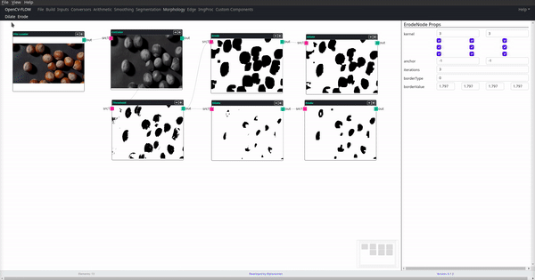

The example in the illustration above uses the OpenCV 4 [Morphological Transformations](https://docs.opencv.org/4.x/d9/d61/tutorial_py_morphological_ops.html) techniques.

To add it to the flow click on morphology -> Erode or Dilate.

Fallow the source code:

```typescript
/**
 * Dilate component and node
 */
export class DilateComponent extends CVFIOComponent {
  static menu = { tabTitle: tabName, title: "Dilate" };
  static processor = class DilateNode extends CVFNodeProcessor {
    properties = [
      { name: "kernel", type: PropertyType.OneZeroMatrix },
      { name: "anchor", type: PropertyType.Point },
      { name: "iterations", type: PropertyType.Integer },
      { name: "borderType", type: PropertyType.BorderType },
      { name: "borderValue", type: PropertyType.Scalar },
    ];

    kernel: Mat = cv.getStructuringElement(
      cv.MORPH_RECT,
      new cv.Size(3, 3),
      new cv.Point(-1, -1)
    );
    anchor: Point = new cv.Point(-1, -1);
    iterations: number = 1;
    borderType: BorderTypes = cv.BORDER_CONSTANT;
    borderValue: Scalar = cv.morphologyDefaultBorderValue();

    async proccess() {
      const { inputs } = this;
      if (inputs.length) {
        this.sources = [];
        for (const src of inputs) {
          const out = new cv.Mat(src.rows, src.cols, src.type());
          GCStore.add(out);

          cv.dilate(
            src,
            out,
            this.kernel,
            this.anchor,
            this.iterations,
            this.borderType,
            this.borderValue
          );
          this.sources.push(out);
          this.output(out);
        }
      }
    }
  };
}

/**
 * Erode component and node
 */
export class ErodeComponent extends CVFIOComponent {
  static menu = { tabTitle: tabName, title: "Erode" };
  static processor = class ErodeNode extends CVFNodeProcessor {
    properties = [
      { name: "kernel", type: PropertyType.OneZeroMatrix },
      { name: "anchor", type: PropertyType.Point },
      { name: "iterations", type: PropertyType.Integer },
      { name: "borderType", type: PropertyType.BorderType },
      { name: "borderValue", type: PropertyType.Scalar },
    ];
    kernel: Mat = cv.getStructuringElement(
      cv.MORPH_RECT,
      new cv.Size(3, 3),
      new cv.Point(-1, -1)
    );
    anchor: Point = new cv.Point(-1, -1);
    iterations: number = 1;
    borderType: BorderTypes = cv.BORDER_CONSTANT;
    borderValue: Scalar = cv.morphologyDefaultBorderValue();

    async proccess() {
      const { inputs } = this;
      if (inputs.length) {
        this.sources = [];
        for (const src of inputs) {
          const out = new cv.Mat(src.rows, src.cols, src.type());
          GCStore.add(out);

          cv.erode(
            src,
            out,
            this.kernel,
            this.anchor,
            this.iterations,
            this.borderType,
            this.borderValue
          );
          this.sources.push(out);
          this.output(out);
        }
      }
    }
  };
}
```
